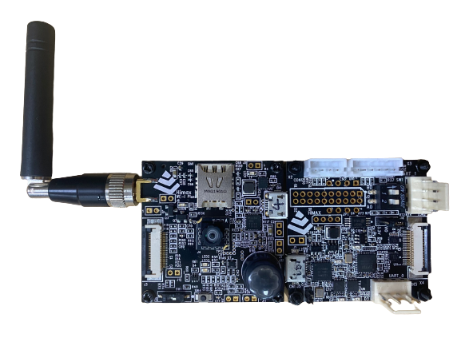
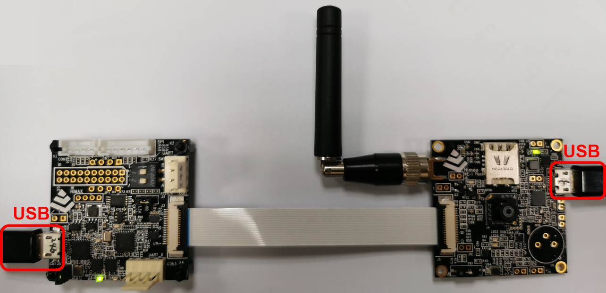
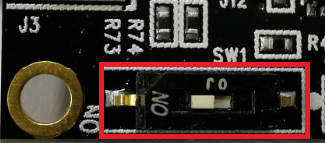
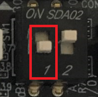
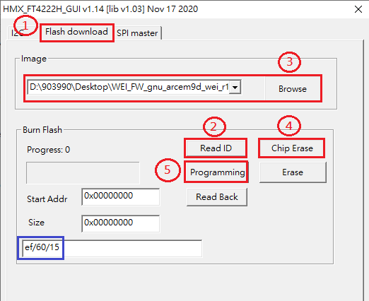

# Himax AIoT Platform EVB USER GUIDE

HIMAX WE1 AIOT Platform includes Himax WE-I Plus MCU, image sensor and rich peripheral supports. The details are given in the following paragraph. 

## Table of contents

- [Himax AIoT Platform EVB USER GUIDE](#himax-we1-evb-user-guide)
  - [Table of contents](#table-of-contents)
  - [Himax AIoT Platform EVB](#himax-aiot-platform-evb)
  - [System Requirement](#system-requirement)
    - [Serial terminal emulation application Setting](#serial-terminal-emulation-application-setting)
  - [Himax AIoT platform startup](#himax-aiot-platform-startup)
    - [Power on EVB](#power-on-evb) 
    - [Flash Image Update](#flash-image-update)
    - [Check UART message output](#check-uart-message-output)
  - [Connect to Azure IoT Hub](#connect-to-azure-iot-hub)
    - [Connect Azure Device Provisioning Service and IoTHub device](#connect-azure-device-provisioning-service-and-iothub-device)
  - [Send Algorithm Metadata](#send-algorithm-metadata)
  - [Send Image](#send-image)
  - [Enter Power Saving Mode](#enter-power-saving-mode)
  - [TensorFlow Lite for Microcontroller example](#tensorflow-lite-for-microcontroller-example)
    - [TFLM Example Person Detection INT8](#tflm-example-person-detection-int8)

## Himax AIoT Platform EVB

  1.	Himax WE-I Plus chip
  2.    Himax Debug Board
  3.	HM0360 AoSTM VGA camera
  4.	Reset Button
  5.	3-Axis Accelerometer
  6.	GREEN LED x2 and RED LEDx1 and BLUE LEDx1  
  7.	Micro USB cable: Debug Board (I2C/SPI/Flash Download)
  8.	Microphones (L/R) at back side 

  <a href="docs/H010_HX6539_NB-IoT_WNB303R_V10.pdf" target="_blank">Board Schematic PDF</a>

## System Requirement
  - Himax AIoT Platform EVB
  - Connection cable
    - Micro usb cable: connect to EVB (as Power/UART)

  - Software Tools
    - HMX_FT4222H_GUI (I2C/CLK/SPI/Flash Download)
    - Serial terminal emulation application
      - In the following description, [TeraTerm](https://ttssh2.osdn.jp/index.html.en) and [Minicom](https://linux.die.net/man/1/minicom) 
        will be used.
    - Flash Binary provided
     
## Himax AIoT platform startup
  - Use the following procedure to startup the Himax AIoT platform.
### Power on EVB
    
 

### Flash Image Update
  - Use FT4222H Tool: after power on EVB
  - NB-IoT board SW1 pin switch to ON
  - Debug board SW1 pin 1 switch to OFF, pin 2 keep ON
    - NB-IoT board
    
    
    
    - Debug board
    
    
    
    - Use GUI_Tool to download EVB image
      - Step 1: Open HMX_FT4222H_GUI.exe and change to Flash download page
      - Step 2: Read ID to check HW ready (ID info Show in blue box)
      - Step 3: Select correct image file
      - Step 4: Erase flash (optional)
      - Step 5: Programming data
      
     
       
### Check UART message output    
  - Serial terminal emulation application Setting 

|   |  |
| :------------ |:---------------:|
| Baud Rate  | 115200 bps |
| Data | 8 bit |
| Parity  | none  |
| Stop  | 1 bit  |
| Flow control | none |   

  The system will output the following message to the UART console. Please setup UART terminal tool setting as (115200/8/N/1).  

##  Connect to Azure IoT Hub
### Connect Azure Device Provisioning Service and IoTHub device
    - Define as follows value  in Himax-AIoT-NB-G1-SDK-Azure-RTOS-main\himax_tflm-master\library\az_sphere\incazure_sphere.h 
      - #define AZURE_DPS_IOTHUB_STANDALONE_TEST 1
      - #define ENDPOINT                        "global.azure-devices-provisioning.net"
      - #define HOST_NAME                       "Key-in your HOST_NAME" 
      - #define REGISTRATION_ID                 "Key-in your REGISTRATION_ID" 
      - #define ID_SCOPE                        "Key-in your ID_SCOPE"
      - #define DEVICE_SYMMETRIC_KEY            "Key-in DEVICE_SYMMETRIC_KEY"
      
more information please reference the file:  
<a href="docs/himax_WEI_Azure_RTOS_Device_getStartedDoc.pdf" target="_blank">Azure user guide PDF</a>
      
## Send Algorithm Metadata
    - Algorithm Metadata structure(sample)
     - humanPresence : 1(detect human) , 0(no human)
     - upper_body_bbox.x : bounding box x-axis for detected human.
     - upper_body_bbox.y : bounding box y-axis for detected human. 
     - upper_body_bbox.width : bounding box width for detected human.
     - upper_body_bbox.height : bounding box height for detected human.
    - Change [azure_active_event]  value  in void tflitemicro_start at Himax-AIoT-NB-G1-SDK-Azure-RTOS-main\himax_tflm-master\app\scenario_app\hx_aiot_nb.c  
     - azure_active_event = ALGO_EVENT_SEND_RESULT_TO_CLOUD;
     
## Send Image
    - Change [azure_active_event]  value  in void tflitemicro_start at Himax-AIoT-NB-G1-SDK-Azure-RTOS-main\himax_tflm-master\app\scenario_app\hx_aiot_nb.c  
     - azure_active_event = ALGO_EVENT_SEND_IMAGE_TO_CLOUD;
     
## Enter Power Saving Mode
    - #define ENABLE_PMU in Himax-AIoT-NB-G1-SDK-Azure-RTOS-main\himax_tflm-master\app\scenario_app\hx_aiot_nb.c 
      
## TensorFlow Lite for Microcontroller example 

  - [TFLM example - person detection INT8](#tflm-example-person-detection-int8)
 
### TFLM Example Person Detection INT8

  To generate person detection example flash binary for Himax AIoT Platform EVB:
  1. Based on the flow of [person detection example](https://github.com/tensorflow/tensorflow/tree/master/tensorflow/lite/micro/examples/person_detection_experimental#person-detection-example) to generate flash image. 
  2. Download image binary to HIMAX WE1 EVB, detail steps can be found at [flash image update](#flash-image-update).
  3. Person detection example message will be shown on the terminal application. 
 